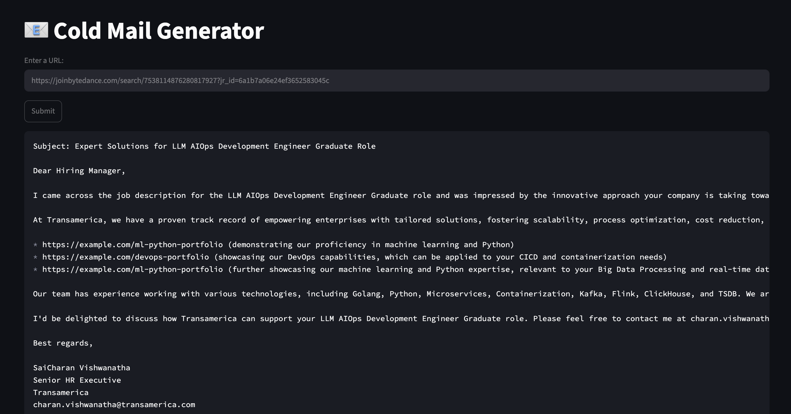

# Cold Email Generator

An AI-powered Cold Email Generator that extracts job postings from company career pages and generates personalized outreach emails.

## Features

* Scrapes job descriptions directly from URLs
* Extracts structured job information using LLMs
* Matches relevant portfolio projects using ChromaDB vector search
* Generates personalized cold emails
* Streamlit-based user interface


## High Level Architecture

```text
┌─────────────────────┐
│      User           │
└──────────┬──────────┘
           │
           ▼
┌─────────────────────┐
│ Streamlit Frontend  │
│  (main.py)          │
└──────────┬──────────┘
           │ URL
           ▼
┌─────────────────────┐
│ WebBaseLoader       │
│ (LangChain)         │
└──────────┬──────────┘
           │
           ▼
┌─────────────────────┐
│ Text Cleaning       │
│ (utils.py)          │
└──────────┬──────────┘
           │
           ▼
┌─────────────────────┐
│ Job Extraction      │
│ Groq + LangChain    │
│ (chains.py)         │
└──────────┬──────────┘
           │
           ▼
┌─────────────────────┐
│ Extracted Job Data  │
│ Role, Skills, Desc  │
└──────────┬──────────┘
           │
           ▼
┌─────────────────────┐
│ ChromaDB Portfolio  │
│ Matching            │
│ (portfolio.py)      │
└──────────┬──────────┘
           │ Relevant Projects
           ▼
┌─────────────────────┐
│ Email Generation    │
│ Groq LLM            │
└──────────┬──────────┘
           │
           ▼
┌─────────────────────┐
│ Personalized Cold   │
│ Email Output        │
└─────────────────────┘
```

### Workflow

1. User enters a job posting URL in the Streamlit application.
2. LangChain's WebBaseLoader scrapes the job description from the webpage.
3. The scraped content is cleaned and normalized.
4. Groq LLM extracts structured job information:

   * Role
   * Experience
   * Required Skills
   * Description
5. ChromaDB performs semantic search against the user's portfolio projects.
6. Relevant portfolio links are retrieved.
7. Groq LLM generates a personalized cold email using:

   * Job description
   * Required skills
   * Matching portfolio projects
8. The generated email is displayed in the Streamlit UI.

```
```


## Tech Stack

* Python
* Streamlit
* LangChain
* Groq LLM
* ChromaDB
* Pandas

## Demo

The application extracts job descriptions, matches portfolio projects using ChromaDB, and generates personalized cold emails.

### Generated Email

<p align="center">
  
</p>


## Setup

### Clone the repository

```bash
git clone https://github.com/saivishwanatha/Cold_Email_Generator.git
cd Cold_Email_Generator
```

### Create virtual environment

```bash
python3 -m venv venv
source venv/bin/activate
```


### Configure environment variables

Create a `.env` file:

```env
GROQ_API_KEY=your_api_key_here
```

### Run the application

```bash
streamlit run app/main.py
```

## Project Structure

```text
app/
├── chains.py
├── main.py
├── portfolio.py
├── utils.py
└── resources/

vectorstore/
README.md
```
